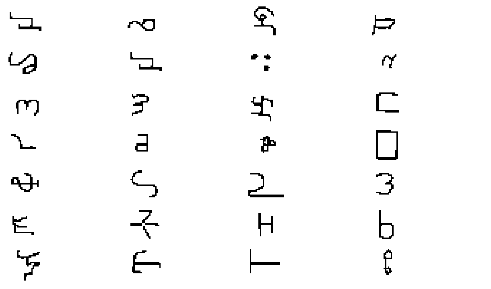

# Handwritten characters

This code reproduces experiments in section 4.2 in the paper.


## Train

You can either train single models or run a sweep over several models.

### Train a single model
To train a single model, run
```
python main.py --cuda --data-location om
```
Run `python main.py --help` for help. To train an alphabet-conditional model, use the `--condition-on-alphabet` flag.

### Sweep over several models
Running `sweep.py` is only compatible with slurm-based clusters and requires installing [openmind-tools](https://github.com/insperatum/openmind-tools), for example by running
```
cd ~
git clone git@github.com:insperatum/openmind-tools.git
echo 'export PATH="$HOME/openmind-tools/bin:$PATH"' >> ~/.bashrc
```

To run a training sweep over the models included in the paper, run
```
python sweep.py --cluster
```
The set of models to be swept over is defined in `sweep.get_sweep_argss`.

In both cases, the model checkpoints will be saved in `save/<path_base>/checkpoints/`:
- the latest checkpoint `latest.pt` and
- intermediate checkpoints `<num_iterations>.pt`,

where `<path_base>` is specified in `util.get_path_base` given run args.

## Plot

To plot diagnostics, run
```
python diagnostics.py --data-location om
```

This will loop over the models in `save/` and create the following plots
- loss curves `losses.pdf`
- stroke primitives `primitives/<iteration>.pdf`
- samples from the prior `prior/<iteration>.pdf`
- reconstructions `reconstructions/<iteration>.pdf`

in `save/<path_base>/` where `<path_base>` is specified in `util.get_path_base`.
To specify a particular checkpoint to plot, use the `--checkpoint-path <checkpoint_path>` flag.


## Evaluating test log likelihood

To evaluate the test likelihood of the trained models, run a sweep by running
```
python sweep.py --cluster --eval-logp
```
This will loop over models defiend by `sweep.get_sweep_argss` and for each model, submit three jobs with `test_algorithm` in `["sleep", "rws", "vimco"]` which
1. Initialize a new inference network and train it for 20k iterations with 100 particles, with the generative model being fixed.
2. Evaluate the log (marginal) likelihood of the generative model using the newly trained inference network using the 5k particles IWAE loss.

The log likelihood values will be saved in `save/<path_base>/logp`.

After the evaluation jobs have all finished, run
```
python eval_logp.py --report
```
to report the log likelihood values and the max across `test_algorithm`s. This represents the best estimate of the log likelihood and is the value reported in the paper.